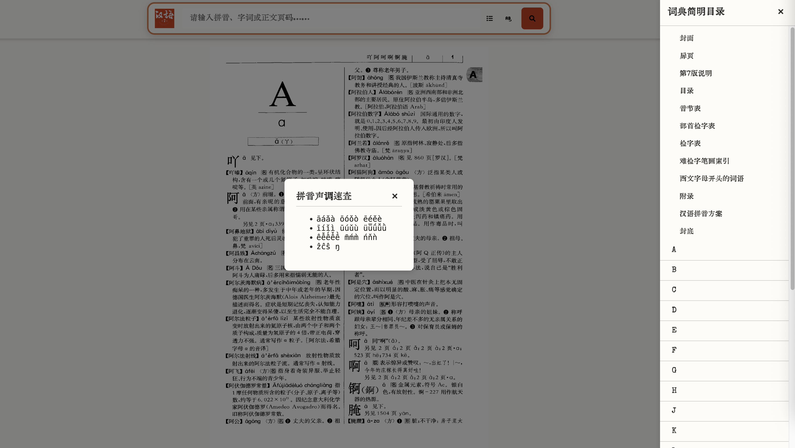

# 《现代汉语词典》在线版

## 说明

《现代汉语词典》在线扫描版（图片格式），支持音节、字词和正文页码检索。

网页截图

参考资料：

- 图片版: <https://github.com/Ano-via/dict>
- 文字版: <https://github.com/CNMan/XDHYCD7th>
- Mdict:
  - <https://forum.freemdict.com/t/topic/12102>
  - <https://forum.freemdict.com/t/topic/25842>
  - <https://github.com/bamboo512/ModernChineseDict>

资源说明：
- icon文件(svg 格式)来自[Lucide][lucide]

[lucide]: https://lucide.dev/

## 声明

词典版权归属原作者（出版社），本站仅供个人学习使用，请勿商用；如有条件，推荐使用纸质版或正式版 APP。
